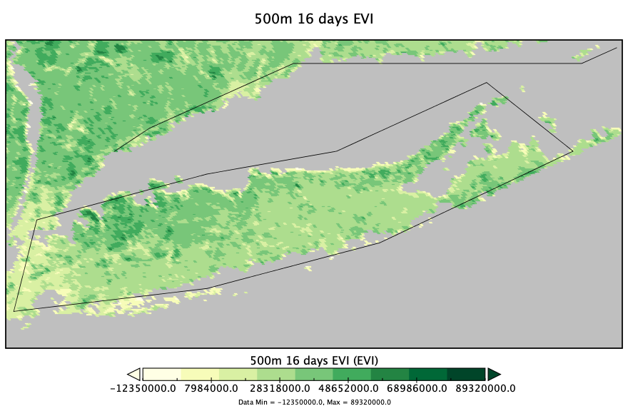
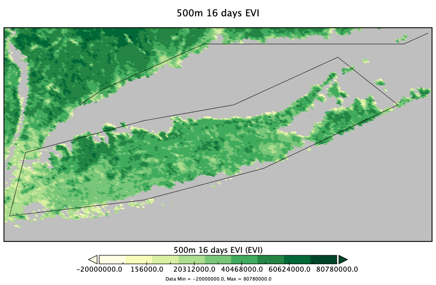
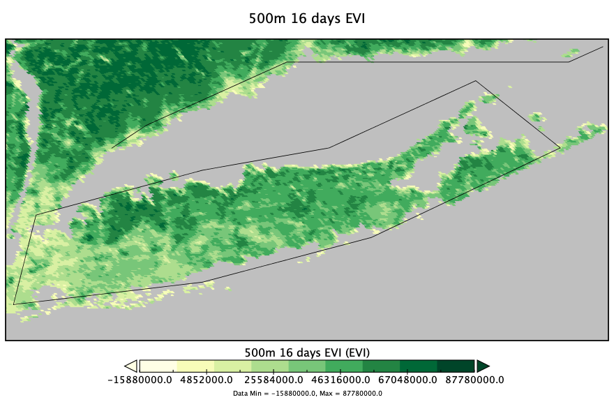
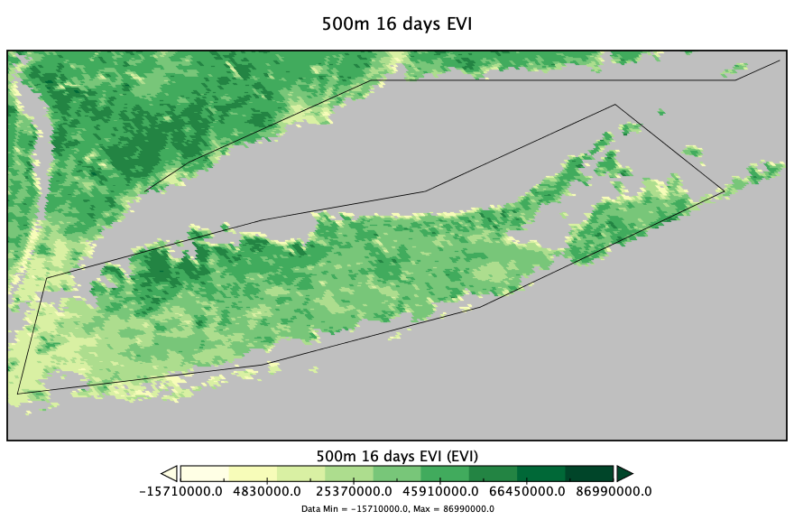

# Environmental Impact of COVID-19

This project examines the "potential impacts of reduced human traffic" in protected environments, such as beaches, parks, marine monuments and other wilderness areas and was created as part of the [NASA SpaceApps COVID-19 Challenge](https://covid19.spaceappschallenge.org/). These impacts could manifest in a number of forms such as:
* Reduction in land degradation
* Change in water quality
* Change in vegetation growth/density

This project focuses on the Long Island area, and tracks EVI (Enhanced Vegetation Index), Surface Albedo (proportion of incident light or radiation is reflected by a surface), and SST (sea surface temperature) in this region. Check out our team [here](https://covid19.spaceappschallenge.org/challenges/covid-challenges/new-perspective/teams/corona-crushers/project)!

## How was this created?
This project was created using NASA remote sensing data from [NASA Goddard Earth Sciences](https://earthdata.nasa.gov/eosdis/daacs/gesdisc), [NASA aqua MODIS](https://oceancolor.gsfc.nasa.gov/data/aqua/), and [NASA terra MODIS](https://terra.nasa.gov/about/terra-instruments/modis). Data was downloaded from [NASA Giovanni](https://giovanni.gsfc.nasa.gov/giovanni/) and [NASA Earthdata search](https://search.earthdata.nasa.gov/search/) in HDF format (for EVI) and netCDF format (for SST and surface albedo) for May 2016-2020 and then visualized using [Panoply](https://www.giss.nasa.gov/tools/panoply/). The visualization showed the level of EVI, SST, and surface albedo on a 9-color scale, with more vibrant colors indicating higher levels of the given variable and paler colors indicating lower levels. After saving the visualization image as a png, it was run through an image processing python script which counted the frequency of each color on the scale and saved the results as a `JSON`. This information was then plotted as interactive graphs using ReactJS and the Material-UI library that show the frequency of each color versus time for all 3 data sets. The site also contains additional information about the variables used.

## Sneak peek
Here is a graph that shows EVI over time

...created from the images above that range from May 2016 to May 2020.

So what can we deduce from this?
* There is a slight increase in vegetation greenness between May 2019 and May 2020 
* There are drastic fluctuations in EVI prior to 2019 meaning that the change in 2020 may not be statistically significant

We plan to increase out dataset to include years prior to 2016 to get a better idea of the trends in EVI and whether or not 2020 marks a significant deviation. If you clone and run this project, you can interact with the EVI chart yourself along with charts for Surface Albedo and SST to draw your own conclusions!

## How do I run this project?
Start by installing [`yarn`](https://classic.yarnpkg.com/en/docs/getting-started)

Then run the following commands in your terminal:
1. `git clone https://github.com/SpaceApps2020/EnvironmentalImpacts.git`
2. `cd EnvironmentalImpacts/enviroviz`
3. `yarn install`
4. `yarn start`

This should automatically open `http://localhost:3000/` on your computer where the webapp will be running!
